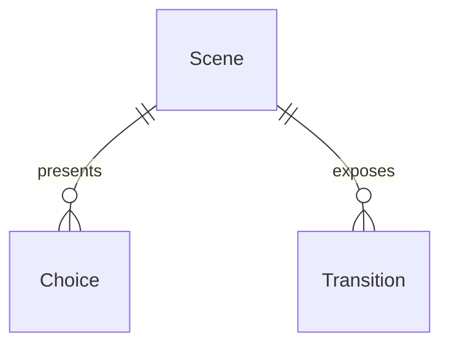
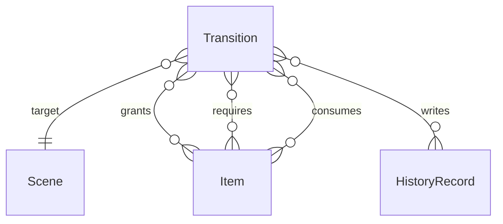

# Scripted Scene Schema Relationships

This note distils the implicit data model behind
`textadventure/data/scripted_scenes.json`. It is intended to give the future web
editor a precise view of how the existing runtime links scenes, transitions,
items, and history requirements so that the API design can mirror those
relationships.

## Top-Level Structure

Scene files are JSON objects whose keys are **scene identifiers**. Each entry is
a scene definition containing three primary fields:

- `description` – Base narration shown when the player arrives in the scene.
- `choices` – Ordered list of available commands, each with a human friendly
  `description`.
- `transitions` – Mapping from command string to the transition definition that
  executes when that command is entered.



Scene identifiers are globally unique within the file because transitions refer
to them via the `target` field.

## Choices

A choice is a lightweight object with two required strings: `command` and
`description`. Commands are unique within a scene and case-insensitive at
runtime. Choices do **not** encode any outcomes themselves—the matching
transition is responsible for all state changes and narration.

```json
{
  "command": "unlock",
  "description": "Use the brass key on the gate."
}
```

## Transitions

A transition bundles the consequences of entering a command. Every transition
must provide a `narration` string and can optionally specify:

- `target` – Destination scene identifier. `null` keeps the player in place.
- `item` – Inventory item awarded on success (one-time per playthrough).
- `requires` – Inventory items needed for success. Missing items trigger either
  the `failure_narration` or a default reminder and the scene does not change.
- `consumes` – Inventory items removed after a successful transition.
- `records` – History entries appended to the player's journal when the
  transition succeeds.
- `narration_overrides` – Ordered list of conditional narration blocks (see
  below).



The runtime resolves all `target` identifiers up front and rejects unknown
references. This makes `Transition.target` a many-to-one relationship pointing
at a valid `Scene`.

### Inventory Semantics

Inventory interactions happen through three disjoint lists:

- `item` → adds exactly one copy of the named item (idempotent).
- `requires` → set of items that must already be present.
- `consumes` → items removed from the inventory when the transition succeeds.

Transitions can simultaneously award and consume different items to model
crafting recipes.

### History Records

History entries (produced via `records`) are opaque strings stored on the world
state's rolling log. They are later queried by conditional narration blocks and
other analytics. The engine never deletes history entries.

## Conditional Narration Overrides

Each entry in `narration_overrides` replaces the base `narration` when all of its
filters pass. Overrides are evaluated in order until the first match succeeds.
Available filters mirror the world state's inventory and history and support
both positive and negative checks:

- `requires_history_all`, `requires_history_any`
- `forbids_history_any`
- `requires_inventory_all`, `requires_inventory_any`
- `forbids_inventory_any`

Overrides can also emit additional `records` if they are the selected branch.

```json
{
  "narration": "The gate clicks open.",
  "requires_history_any": ["Studied the gate glyphs"],
  "forbids_inventory_any": ["rusty-key"],
  "records": ["Opened gate with knowledge"]
}
```

The override schema is intentionally parallel to the top-level transition fields
so the editor can reuse validation logic and UI components across both layers.

## Derived Relationships

To support analytics and validation, the runtime computes additional derived
relationships from the scene definitions:

- **Item flow** – A given item may have multiple sources (transitions with
  `item`), requirements (`requires` lists), and consumption sites (`consumes`
  lists). These relationships are surfaced in
  `textadventure.analytics.analyse_item_flow` for reporting.
- **Scene graph** – Directed edges are formed by every transition with a
  non-null `target`. Reachability analyses such as
  `textadventure.analytics.compute_scene_reachability` walk this graph.
- **History usage** – Both transitions and overrides append to the world state's
  history via `records`, while overrides read from the history to gate
  narration. Designing APIs or UI affordances should treat history entries as
  free-form identifiers referenced across scenes.

Understanding these relationships will help the web editor surface impact
analysis (e.g., "deleting this scene breaks 3 transitions" or "this item is
consumed but never awarded") and mirror the runtime's validation guarantees.
